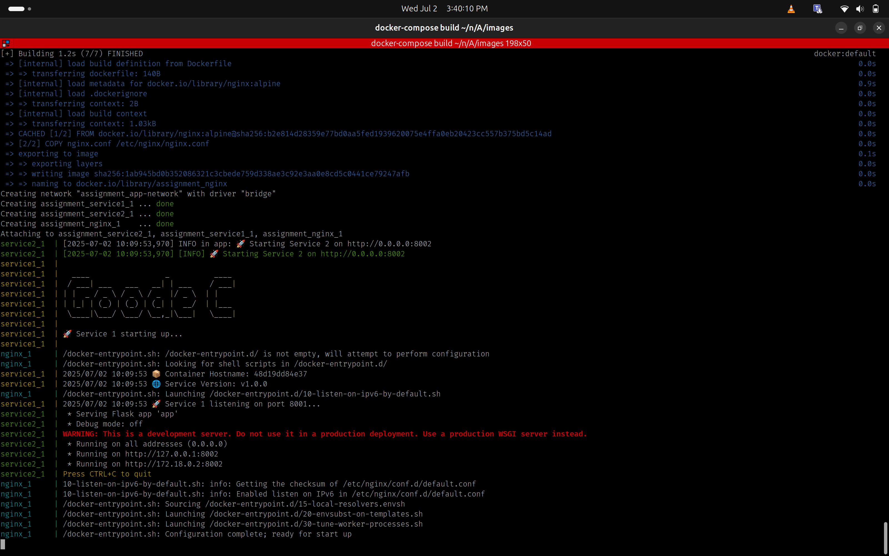
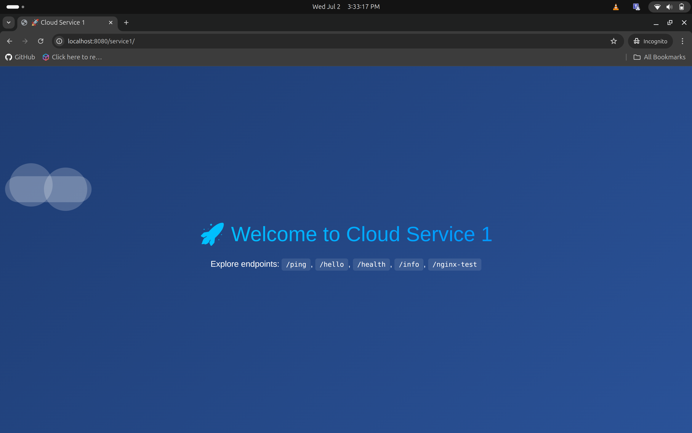
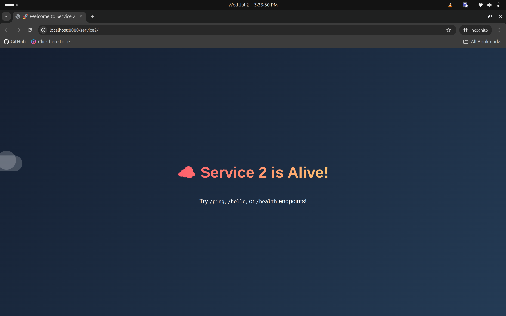

# 🐳 Nginx Reverse Proxy with Docker Microservices

[](https://docker.com)
[](https://golang.org)
[](https://python.org)
[](https://nginx.org)

A containerized microservices architecture using Nginx as a reverse proxy for Go and Python backend services, orchestrated with Docker Compose.

## 📋 Overview

This project demonstrates how to set up a reverse proxy using Nginx to route requests between multiple microservices. The architecture includes two backend services - one built with Go and another with Python - all containerized using Docker.

## 🏗️ Architecture

```
🌐 Client Request → 🔄 Nginx (Port 8080) → 🎯 Backend Services
├── 📍 /service1/* → 🟢 Go Service (Port 8001)
└── 📍 /service2/* → 🐍 Python Service (Port 8002)
```

## ⚡ Prerequisites

- 🐳 [Docker](https://docs.docker.com/get-docker/)
- 🔧 [Docker Compose](https://docs.docker.com/compose/install/)

## 🚀 Installation & Setup

### 🐧 For Ubuntu/Linux

```bash
# 📦 Install Docker & Docker Compose
sudo apt update
sudo apt install docker.io docker-compose -y
sudo systemctl enable docker
sudo systemctl start docker

# 📥 Clone the repository
git clone -b feature/nginx-docker-assignment https://github.com/niranjan-46/nginx-docker-assignment.git
cd nginx-docker-assignment

# 🏗️ Build and run the containers
docker-compose up --build
```

### 🪟 For Windows (Docker Desktop)

1. 📥 Install Docker Desktop and ensure it's running
2. 💻 Open PowerShell or WSL and run:

```bash
git clone -b feature/nginx-docker-assignment https://github.com/niranjan-46/nginx-docker-assignment.git
cd nginx-docker-assignment
docker-compose up --build
```

### 🔨 Build & Startup (Docker Compose)



*🏗️ Docker Compose building and starting all services*

```log
✅ Building nginx...
✅ Building service1...
✅ Building service2...
🚀 Starting nginx-proxy_nginx_1...
🚀 Starting nginx-proxy_service1_1...
🚀 Starting nginx-proxy_service2_1...
🟢 All services are up and running!
```

## 🎯 Usage

Once the services are running, access the application at: 
> 🌐 **http://localhost:8080**

### 🧪 Testing the Services

**🟢 Go Service (/service1)**:



*🚀 Go service endpoints and responses*

```bash
# 🏓 Ping test
curl http://localhost:8080/service1/ping
# Response: {"message": "pong", "service": "go-service"}

# 👋 Hello endpoint
curl http://localhost:8080/service1/hello
# Response: {"message": "Hello from Go Service!", "timestamp": "2024-01-15T10:30:00Z"}

# 💚 Health check
curl http://localhost:8080/service1/health
# Response: {"status": "healthy", "service": "go-service", "uptime": "2h30m"}
```

**🐍 Python Service (/service2)**:



*🔥 Python service endpoints and responses*

```bash
# 🏓 Ping test
curl http://localhost:8080/service2/ping
# Response: {"message": "pong", "service": "python-service"}

# 👋 Hello endpoint
curl http://localhost:8080/service2/hello
# Response: {"message": "Hello from Python Service!", "timestamp": "2024-01-15T10:30:00Z"}

# 💚 Health check
curl http://localhost:8080/service2/health
# Response: {"status": "healthy", "service": "python-service", "uptime": "2h30m"}
```

## 📁 Project Structure

```
📂 nginx-docker-assignment/
├── 🐳 docker-compose.yml         # Docker Compose configuration
├── 📂 nginx/
│   ├── ⚙️ nginx.conf             # Nginx reverse proxy rules
│   └── 🐳 Dockerfile             # Nginx container build
├── 📂 service_1/                 # Go microservice
│   ├── 🟢 main.go
│   ├── 📦 go.mod
│   └── 🐳 Dockerfile
├── 📂 service_2/                 # Python microservice
│   ├── 🐍 app.py
│   ├── 📋 requirements.txt
│   └── 🐳 Dockerfile
└── 📖 README.md                  # Project documentation
```

## ⚙️ How It Works

**🔄 Nginx Reverse Proxy**: Nginx listens on port 8080 and routes incoming requests to the appropriate backend services based on URL paths.

- 📍 `/service1/*` → 🟢 Go service running on port 8001
- 📍 `/service2/*` → 🐍 Python service running on port 8002

Each service provides the following endpoints:

- 🏓 `/ping` — Connectivity check
- 👋 `/hello` — Test response  
- 💚 `/health` — Health check

**🐳 Containerization**: All services are containerized using Docker and orchestrated with Docker Compose for easy deployment.

### 🌊 Architecture Flow

The following images show the complete workflow:

## 🎮 Managing Services

**🚀 Start services:**
```bash
docker-compose up --build
```
```log
🔍 Pulling images...
🏗️ Building services...
🚀 Starting containers...
✅ Services ready at http://localhost:8080
```

**🌙 Start services in background:**
```bash
docker-compose up --build -d
```
```log
✅ Services started in detached mode
🔍 Use 'docker-compose logs' to view output
```

**🛑 Stop services:**
```bash
docker-compose down
```
```log
🛑 Stopping containers...
🗑️ Removing containers...
✅ Services stopped successfully
```

**📋 View logs:**
```bash
docker-compose logs
```
```log
📊 nginx_1    | 2024/01/15 10:30:00 [notice] 1#1: nginx/1.21.0
📊 service1_1 | 2024/01/15 10:30:01 🚀 Go service started on :8001
📊 service2_1 | 2024/01/15 10:30:01 🐍 Python service started on :8002
```

**📈 View specific service logs:**
```bash
# 🟢 Go service logs
docker-compose logs service1

# 🐍 Python service logs  
docker-compose logs service2

# 🔄 Nginx logs
docker-compose logs nginx
```

## 🛠️ Technology Stack

- 🔄 **Nginx**: Reverse proxy and load balancer
- 🟢 **Go**: High-performance backend service
- 🐍 **Python**: Backend service using Flask/FastAPI
- 🐳 **Docker**: Containerization platform
- 🔧 **Docker Compose**: Multi-container orchestration

## 🩹 Troubleshooting Build Issues

If you encounter build issues, try cleaning up old containers and images:

```bash
# 🧹 Complete cleanup
docker-compose down -v --remove-orphans
docker system prune -f
docker-compose build --no-cache
docker-compose up
```

```log
⚠️  Removing containers and volumes...
🧹 Pruning system resources...
🏗️ Building without cache...
✅ Fresh build completed successfully!
```

### 🔍 Common Issues & Solutions

| ❌ Issue | 💡 Solution |
|----------|-------------|
| Port 8080 already in use | `sudo lsof -i :8080` then kill the process |
| Docker daemon not running | `sudo systemctl start docker` |
| Permission denied | `sudo usermod -aG docker $USER` then logout/login |
| Build fails | Run cleanup commands above |

## 👨‍💻 Author

**Niranjan** 🚀  
📧 Contact: [GitHub Profile](https://github.com/niranjan-46)  
🔗 GitHub: [@niranjan-46](https://github.com/niranjan-46)

## 📜 License & Attribution

⭐ **Star this repo** if you found it helpful!

🍴 **Fork it** to create your own version

📝 *This project was completed as part of an internship assignment to demonstrate containerized microservices architecture with Nginx reverse proxy.*

---

<div align="center">

### 🎉 Happy Coding! 

Made with ❤️ by [Niranjan](https://github.com/niranjan-46)

[](https://github.com/niranjan-46/nginx-docker-assignment)
[](https://github.com/niranjan-46/nginx-docker-assignment)

</div>
